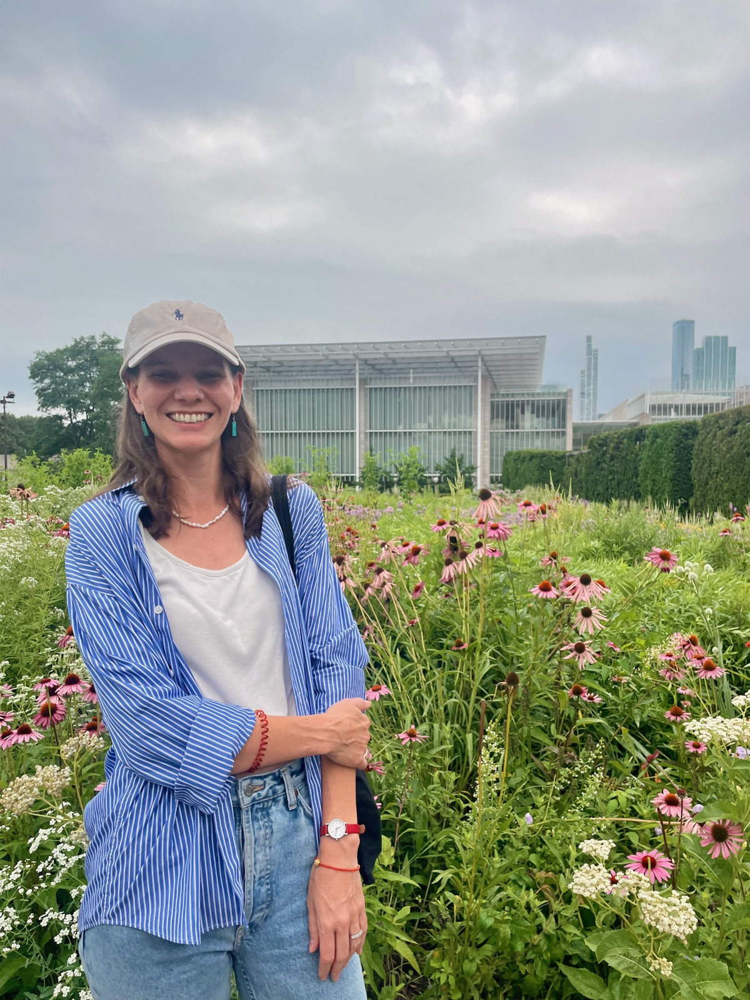

---
# Feel free to add content and custom Front Matter to this file.
# To modify the layout, see https://jekyllrb.com/docs/themes/#overriding-theme-defaults

layout: home
---
Assistant Professor  
Dept. of Computer Science, ECOT 820  
University of Colorado Boulder  
rebeccam@colorado.edu  

CU Boulder, January 2026

<!--  -->

*If you would like to talk to me about research opportunities, grading or TA positions, reference letters, or just about anything else, please come to my office hours or drop by my office anytime. I am usually free Monday - Thursday 9:30 - 11:00.*  

**Office hours for Fall 2026 are:  Wednesday 10:00 - 11:00.**

## Research interests
Dynamical systems  
Probabilistic graphical models  
Calibration, validation, and uncertainty quantification

## Research group  
Robert Dumitrescu (CS PhD)  
Nate Holland (CS PhD)  
Ujas Shah (CS PhD)  
Jack Shaw (CS + Geology Postdoc)  
Josiah Shehata, CS Capstond: Senior Thesis, 2026 -- 2027  

## Previous group members

### PhD
[Teo Price-Broncucia](https://teopb.github.io), CS PhD, 2025  
[Rileigh Bandy](https://rbandy.github.io/), CS PhD, 2024  

### Masters
Rachel Washington, Summer intern, 2024  

### Undergraduate
Sienna Amorese (Applied Math: Stats), Latin Senior Thesis, 2024 -- 2025  
Daniel Crook, Discovery Learning Apprenticeship (DLA), 2020 -- 2021  
Michael Donovan, DLA, 2020 -- 2021
